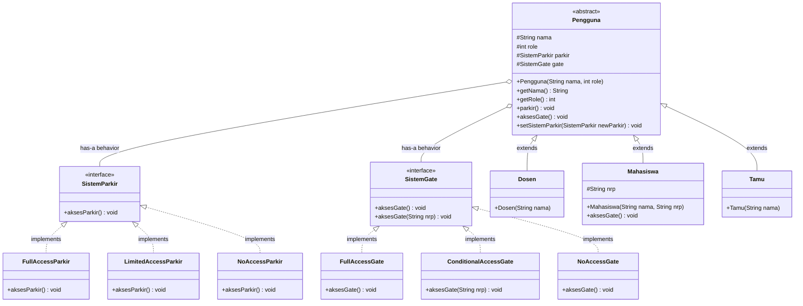

# Simulasi Sistem Parkir Gate Teknik Elektro ITS

> [!NOTE]
> Status: **Work in Progress**

| Nama              | NRP        |
| ----------------- | ---------- |
| Hendra Manudinata | 5027251051 |

Ini adalah simulasi sistem parkir dan gate untuk Teknik Elektro ITS, yang dirancang menggunakan prinsip Object-Oriented Programming (OOP). Sistem ini mencakup berbagai jenis pengguna (Dosen, Mahasiswa, Tamu) dengan hak akses yang berbeda terhadap fasilitas parkir dan gate. Program ini juga menyertai _special setter_ untuk mengubah perilaku parkir secara dinamis, serta implementasi interface untuk mengelola akses gate berdasarkan peran pengguna.

Kode dibuat seminimal mungkin untuk fokus pada konsep OOP, sehingga beberapa detail implementasi mungkin disederhanakan atau diabaikan.

## Class Diagram

_Klik tombol salin untuk menyalin kode diagram ke clipboard._

## Deskripsi Sistem

Sistem ini terdiri dari beberapa kelas utama yang merepresentasikan pengguna dan sistem parkir serta gate. Setiap pengguna memiliki hak akses yang berbeda terhadap fasilitas parkir dan gate, yang diimplementasikan melalui interface dan kelas konkret.

## Prinsip OOP yang Digunakan

### 1. Encapsulation

Setiap kelas memiliki atribut dan metode yang membungkus data dan perilaku terkait, menjaga agar data tetap aman dan hanya dapat diakses melalui metode yang telah ditentukan.

### 2. Inheritance

Kelas `Dosen`, `Mahasiswa`, dan `Tamu` mewarisi dari kelas abstrak `Pengguna`, memungkinkan mereka untuk memiliki atribut dan metode yang sama, serta menambahkan perilaku khusus sesuai kebutuhan.

### 3. Polymorphism

Melalui penggunaan interface `SistemParkir` dan `SistemGate`, sistem dapat menangani berbagai jenis akses parkir dan gate secara fleksibel, memungkinkan pengguna untuk berinteraksi dengan sistem tanpa perlu mengetahui detail implementasi.

### 4. Abstraction

Kelas `Pengguna` adalah kelas abstrak yang mendefinisikan struktur dasar untuk semua jenis pengguna, sementara kelas konkret seperti `Dosen`, `Mahasiswa`, dan `Tamu` mengimplementasikan detail spesifik sesuai dengan peran mereka dalam sistem.
