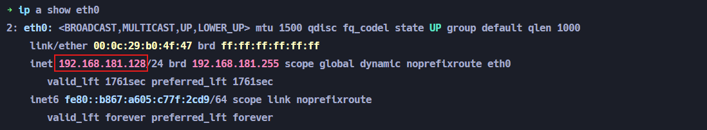
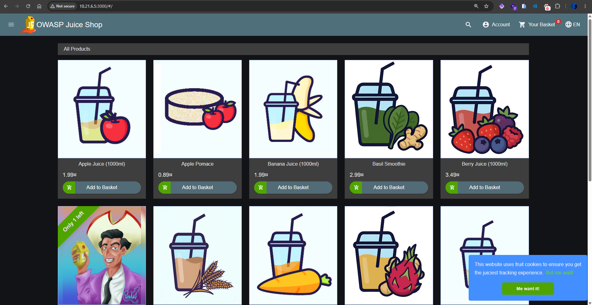
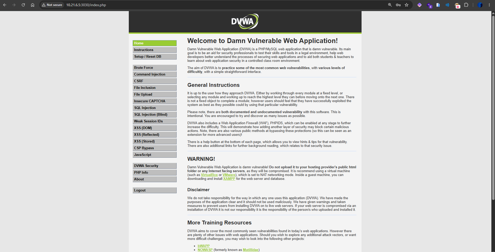

# Bab 0 - Membangun Fondasi Cyber Range

Sebelum kita mulai bab pertama yang sesungguhnya, ada satu hal yang perlu diselesaikan lebih dulu: menyiapkan "medan latihan" kita. Di buku ini, medan latihan itu disebut **cyber range** — lingkungan lab terisolasi di laptop kamu sendiri, tempat semua praktik akan dilakukan tanpa risiko menyentuh sistem nyata siapapun.

Bab ini bukan tentang belajar sesuatu yang baru secara konseptual. Ini murni tentang instalasi dan konfigurasi. Prosesnya mungkin terasa agak panjang kalau ini pertama kalinya kamu menyiapkan lab keamanan siber, tapi investasi waktu di sini akan terbayar lunas di bab-bab selanjutnya — karena kamu tidak perlu khawatir soal infrastruktur lagi, tinggal fokus ke materi.

Estimasi waktu: **1–2 jam** (tergantung kecepatan internet dan spek laptop).

---

## Mengapa Butuh Setup Seperti Ini?

Kamu mungkin bertanya: kenapa tidak bisa langsung belajar di VM online atau pakai environment yang sudah jadi? Alasannya ada beberapa:

**Kendali penuh atas environment**: Praktik keamanan siber butuh kamu bisa mengatur jaringan, menjalankan tool yang mungkin di-flag oleh AV/IDS, dan kadang sengaja membuat sistem dalam kondisi rentan. Ini tidak bisa dilakukan di environment yang tidak sepenuhnya kamu kendalikan.

**Isolasi dari jaringan nyata**: Semua target latihan kita — aplikasi web yang rentan, service yang vulnerable — harus berjalan di jaringan yang terisolasi dari internet dan dari jaringan rumah/kantor kamu. Kalau tidak, kamu secara tidak sengaja bisa mengekspos sistem vulnerable tersebut ke publik.

**Reproducibility**: Lab yang kamu bangun sendiri bisa di-snapshot, di-reset, dan di-rebuild kapan saja. Kalau sesuatu rusak karena percobaan yang terlalu agresif, cukup rollback.

---

## Gambaran Arsitektur Lab

Sebelum mulai instal, ada baiknya kamu punya gambaran besar dulu tentang apa yang akan kita bangun:

```
┌─────────────────────────────────────────────────────────────────┐
│                        LAPTOP KAMU (Host OS)                    │
│                                                                 │
│  ┌────────────────────────────────────────────────────────────┐ │
│  │           VirtualBox/Vmware                                │ │
│  │                                                            │ │
│  │   ┌──────────────────────────────────────────────────┐     │ │
│  │   │  Kali Linux VM                                    │    │ │
│  │   │  Peran: ATTACKER (semua tool pentest ada di sini) │    │ │
│  │   └──────────────────────────────────────────────────┘     │ │
│  └────────────────────────────────────────────────────────────┘ │
│                                                                 │
│  ┌────────────────────────────────────────────────────────────┐ │
│  │           Docker Engine                                    │ │
│  │                                                            │ │
│  │                 ┌──────────┐  ┌──────────┐                 │ │
│  │                 │ Container│  │ Container│                 │ │
│  │                 │ Target A │  │ Target B │                 │ │
│  │                 │ (DVWA)   │  │(Juice Shop)│               │ │
│  │                 └──────────┘  └──────────┘                 │ │
│  │                                                            │ │
│  └────────────────────────────────────────────────────────────┘ │
└─────────────────────────────────────────────────────────────────┘
```

Kali Linux = "attacker" yang akan menyerang target. Docker container = target-target latihan yang sengaja vulnerable. Keduanya berkomunikasi melalui jaringan host-only yang terisolasi.

---

## Spesifikasi Minimum Laptop

Sebelum lanjut, pastikan laptop kamu memenuhi syarat berikut:

| Komponen | Minimum                                  | Direkomendasikan  |
| -------- | ---------------------------------------- | ----------------- |
| CPU      | Intel/AMD 64-bit, mendukung virtualisasi | Quad-core ke atas |
| RAM      | 8 GB                                     | 16 GB             |
| Storage  | 50 GB kosong                             | 100 GB SSD        |

---

## Langkah 1 — Instalasi Kali Linux

Untuk melakukan instalasi dapat menggunakan panduan melalui video - video berikut ini:

| Instalasi                                        | Video                        |
| ------------------------------------------------ | ---------------------------- |
| Install Kali Linux VirtualBox on Windows         | https://youtu.be/EvQLXtnb5mE |
| Install Kali Linux VMWare Workstation on Windows | https://youtu.be/XzD8JIAOk2I |
| Install Kali Linux via UTM on MacOS              | https://youtu.be/bcaF1OSivYI |

Setelah instalasi selesai, coba cek IP pada machine yang sudah kamu install, dengan command berikut

```sh
ip a show eth0
```



## Langkah 2 — Instalasi Docker

Docker akan menjalankan target-target latihan kita (DVWA, Juice Shop, Metasploitable, dll.) sebagai container yang ringan dan mudah di-reset.

```sh
# Update package list
sudo apt-get update

# Install dependencies
sudo apt-get install -y ca-certificates curl gnupg

# Tambahkan Docker repository
sudo install -m 0755 -d /etc/apt/keyrings
curl -fsSL https://download.docker.com/linux/ubuntu/gpg | sudo gpg --dearmor -o /etc/apt/keyrings/docker.gpg
echo "deb [arch=$(dpkg --print-architecture) signed-by=/etc/apt/keyrings/docker.gpg] \
  https://download.docker.com/linux/ubuntu \
  $(. /etc/os-release && echo "$VERSION_CODENAME") stable" | \
  sudo tee /etc/apt/sources.list.d/docker.list > /dev/null

# Install Docker
sudo apt-get update
sudo apt-get install -y docker-ce docker-ce-cli containerd.io docker-compose-plugin

# Izinkan user biasa menjalankan docker tanpa sudo
sudo usermod -aG docker $USER

# Logout dan login ulang agar perubahan berlaku
```

### Verifikasi Docker

```sh
docker run hello-world
```

Kalau berhasil, kamu akan melihat pesan "Hello from Docker!" — Docker sudah siap.

---

## Langkah 3 — Instalasi Juice Shop & DVWA

Masuk ke dalam folder `./resources` lalu kemudian jalankan command berikut init

```sh
docker compose up -d
```

Setelah dijalankan coba akses setiap target tersebut menggunakan IP tadi dengan target masing - masing port yang ada yaitu:

`3000` untuk Juice Shop



`3030` untuk DVWA



Untuk menghentikan kedua target tersebut dapat menggunakan command berikut:

```sh
docker compose down
```

---

## Video Tutorial

https://youtu.be/N5CnCwo12YM
