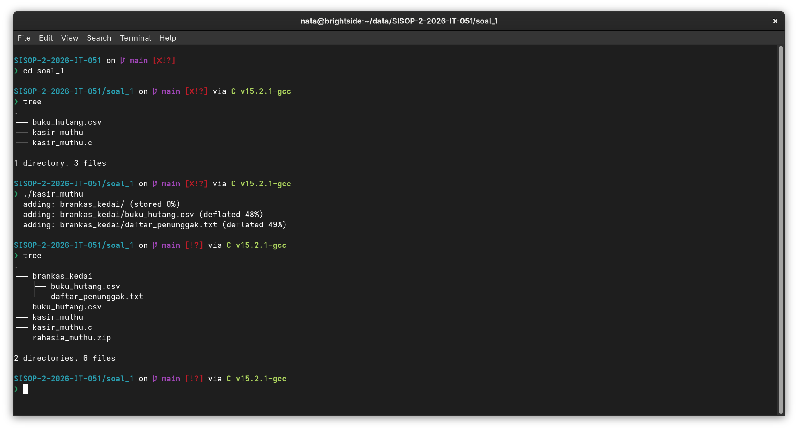
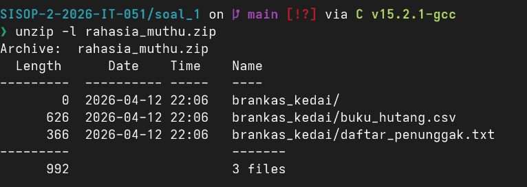
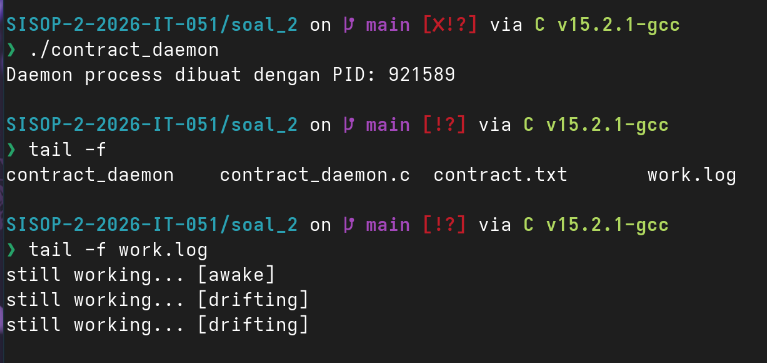
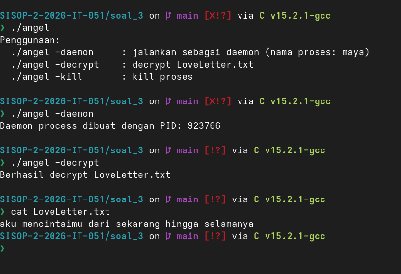

# SISOP-2-2026-IT-051

> [!NOTE]
> Maaf lapres nya singkat. Tapi ini aseli bikin sendiri tanpa copas.

<details>
<summary>Daftar Isi</summary>

- [SISOP-2-2026-IT-051](#sisop-2-2026-it-051)
  - [Soal 1: Kasbon Warga Kampung Durian Runtuh](#soal-1-kasbon-warga-kampung-durian-runtuh)
    - [Deskripsi Soal](#deskripsi-soal)
    - [Menjalankan Program](#menjalankan-program)
    - [Penjelasan Soal](#penjelasan-soal)
      - [1. Helper `run_exec()`](#1-helper-run_exec)
      - [2. `mkdir` folder brankas](#2-mkdir-folder-brankas)
      - [3. `cp` file CSV](#3-cp-file-csv)
      - [4. `grep` data penunggak](#4-grep-data-penunggak)
      - [5. `zip` hasil akhir](#5-zip-hasil-akhir)
      - [6. Error handling](#6-error-handling)
    - [Kendala](#kendala)
    - [Revisi](#revisi)
  - [Soal 2: The world never stops, even when you feel tired.](#soal-2-the-world-never-stops-even-when-you-feel-tired)
    - [Deskripsi Soal](#deskripsi-soal-1)
    - [Menjalankan Program](#menjalankan-program-1)
    - [Penjelasan Soal](#penjelasan-soal-1)
      - [1. Setup daemon](#1-setup-daemon)
      - [2. Pembuatan dan restore contract](#2-pembuatan-dan-restore-contract)
      - [3. Deteksi pelanggaran contract](#3-deteksi-pelanggaran-contract)
      - [4. Penulisan status berkala ke work.log](#4-penulisan-status-berkala-ke-worklog)
      - [5. Handler SIGINT](#5-handler-sigint)
    - [Kendala](#kendala-1)
    - [Revisi](#revisi-1)
  - [Soal 3: One letter for destiny](#soal-3-one-letter-for-destiny)
    - [Deskripsi Soal](#deskripsi-soal-2)
    - [Menjalankan Program](#menjalankan-program-2)
    - [Penjelasan Soal](#penjelasan-soal-2)
      - [1. Implementasi Base64 manual](#1-implementasi-base64-manual)
      - [2. Logging aktivitas ke ethereal.log](#2-logging-aktivitas-ke-ethereallog)
      - [3. Mode daemon (`-daemon`)](#3-mode-daemon--daemon)
      - [4. Mode decrypt (`-decrypt`)](#4-mode-decrypt--decrypt)
      - [5. Mode kill (`-kill`)](#5-mode-kill--kill)
    - [Kendala](#kendala-2)
    - [Revisi](#revisi-2)

</details>

## Soal 1: Kasbon Warga Kampung Durian Runtuh

### Deskripsi Soal

Program diminta untuk mengotomasi serangkaian command Linux menggunakan proses parent-child dengan `fork()`, `exec()`, dan `wait()`:

1. Membuat direktori `brankas_kedai`
2. Menyalin `buku_hutang.csv` ke direktori tersebut
3. Mengambil baris dengan status `Belum Lunas` ke file `daftar_penunggak.txt`
4. Mengarsipkan hasil ke `rahasia_muthu.zip`

### Menjalankan Program

```bash
$ cd soal_1
$ gcc kasir_muthu.c -o kasir_muthu
$ ./kasir_muthu
```

Jika sukses, hasil akhirnya:

- Folder `brankas_kedai/`
- File `brankas_kedai/buku_hutang.csv`
- File `brankas_kedai/daftar_penunggak.txt`
- Arsip `rahasia_muthu.zip`



### Penjelasan Soal

#### 1. Helper `run_exec()`

Kode utama dibungkus dalam helper `run_exec(const char *path, char *const argv[])` agar tiap command punya pola eksekusi yang sama:

1. `fork()` untuk membuat child process
2. Child menjalankan `execv(path, argv)`
3. Parent menunggu dengan `wait()`
4. Parent mengecek status exit proses child

Jika `fork()` gagal atau child exit non-zero, fungsi mengembalikan nilai error.

```c
int run_exec(const char *path, char *const argv[]) {
  pid_t pid = fork();

  if (pid < 0) {
    return -1; // error saat fork
  }

  if (pid == 0) {
    execv(path, argv);
    return 0;
  } else {
    // proses induk: tunggu proses anak selesai
    int status;
    wait(&status);
    if (!WIFEXITED(status) || WEXITSTATUS(status) != 0) {
      return -1; // error saat exec
    }
  }

  return 0; // sukses
}
```

#### 2. `mkdir` folder brankas

Program memanggil:

```c
char *mkdir_args[] = {"mkdir", "brankas_kedai", NULL};
run_exec("/usr/bin/mkdir", mkdir_args);
```

Ini memenuhi requirement pembuatan direktori via `exec`.

#### 3. `cp` file CSV

Setelah folder tersedia, program menyalin sumber data:

```c
char *cp_args[] = {"cp", "buku_hutang.csv", "brankas_kedai", NULL};
run_exec("/usr/bin/cp", cp_args);
```

#### 4. `grep` data penunggak

Untuk menyimpan hanya pelanggan dengan status `Belum Lunas`, command dijalankan lewat shell agar bisa memakai redirection `>`:

```c
char *grep_args[] = {
  "bash", "-c",
  "grep 'Belum Lunas' buku_hutang.csv > brankas_kedai/daftar_penunggak.txt",
  NULL
};
run_exec("/usr/bin/bash", grep_args);
```

Hasil file `daftar_penunggak.txt` berisi baris-baris yang statusnya belum lunas.

#### 5. `zip` hasil akhir

Tahap akhir adalah mengarsipkan folder:

```c
char *zip_args[] = {"zip", "-r", "rahasia_muthu.zip", "brankas_kedai/", NULL};
run_exec("/usr/bin/zip", zip_args);
```



#### 6. Error handling

Setiap tahap dicek. Jika ada satu command gagal, program lompat ke label `error` dan menampilkan pesan kegagalan.

### Kendala

- Redirection output (`>`) tidak bisa diproses langsung oleh `execv`, sehingga perlu dibungkus `bash -c`.
- Perlu path absolut executable (`/usr/bin/mkdir`, `/usr/bin/cp`, dll.) agar `execv` konsisten.

### Revisi

_Belum ada revisi untuk soal 1._

## Soal 2: The world never stops, even when you feel tired.

### Deskripsi Soal

Program ini membuat daemon yang berjalan terus di background untuk:

1. Menjaga keberadaan dan isi `contract.txt`
2. Mendeteksi perubahan isi contract
3. Menulis status berkala ke `work.log`
4. Menangani sinyal `SIGINT`



### Menjalankan Program

```bash
$ cd soal_2
$ gcc contract_daemon.c -o contract_daemon
$ ./contract_daemon
```

Program parent akan keluar, lalu daemon lanjut berjalan di background.

### Penjelasan Soal

#### 1. Setup daemon

Program melakukan pola daemon standar:

1. `fork()`
2. Parent exit
3. Child memanggil `setsid()`
4. Set `umask(0)`

Dengan pola ini, proses daemon berjalan terpisah dari terminal.

```c
  pid_t pid, sid;

  pid = fork();
  if (pid < 0) {
    printf("Gagal bikin daemon!\n");
    exit(EXIT_FAILURE);
  }
  if (pid > 0) {
    printf("Daemon process dibuat dengan PID: %d\n", pid);
    exit(EXIT_SUCCESS);
  }

  umask(0);

  sid = setsid();
  if (sid < 0) {
    exit(EXIT_FAILURE);
  }
```

#### 2. Pembuatan dan restore contract

Fungsi `writeContract()` menulis isi dasar ke `contract.txt`:

```text
A promise to keep going, even when unseen.
```

Lalu ditambah timestamp:

- `created-at: ...` saat pertama kali dibuat
- `restored-at: ...` saat file perlu dipulihkan

#### 3. Deteksi pelanggaran contract

Daemon menyimpan snapshot isi file sebelumnya (`previous_log`) dan membandingkan dengan isi saat ini (`log_text`).

Jika isi berubah (dan bukan run pertama), daemon menganggap contract dilanggar, lalu:

1. Menulis `contract violated` ke `work.log`
2. Menimpa ulang `contract.txt` dengan mode restore

#### 4. Penulisan status berkala ke work.log

Setiap 5 detik, daemon menulis:

```text
still working... [awake|drifting|numbness]
```

Status diambil random dari array melalui `getRandomStatus()`.

#### 5. Handler SIGINT

Ketika menerima `SIGINT`, handler menulis pesan:

```text
We really weren't meant to be together
```

setelah itu proses daemon berhenti dengan `_exit(0)`.

### Kendala

- Membuat deteksi perubahan file yang aman tanpa false positive saat startup (diselesaikan dengan flag `first_run`).
- Menjaga alur create/restore agar tidak loop menulis file terus-menerus.

### Revisi

_Belum ada revisi untuk soal 2._

## Soal 3: One letter for destiny

### Deskripsi Soal

Program memiliki 3 mode eksekusi:

1. `-daemon`: menghasilkan pesan acak, encode Base64, simpan ke `LoveLetter.txt` berkala
2. `-decrypt`: decode isi `LoveLetter.txt` menjadi plain text
3. `-kill`: menghentikan daemon berdasarkan nama proses

Semua aktivitas dicatat ke `ethereal.log`.



### Menjalankan Program

```bash
$ cd soal_3
$ gcc angel.c -o angel
```

Jalankan daemon:

```bash
$ ./angel -daemon
```

Decrypt isi file:

```bash
$ ./angel -decrypt
```

Hentikan daemon:

```bash
$ ./angel -kill
```

### Penjelasan Soal

#### 1. Implementasi Base64 manual

Program tidak memakai library eksternal Base64. Fungsi `base64_encode()` dan `base64_decode()` dibuat manual dengan:

- Tabel karakter Base64
- Reverse table untuk decode
- Penanganan padding `=`
- Validasi karakter ilegal saat decode

#### 2. Logging aktivitas ke ethereal.log

Setiap mode menulis log melalui `write_log()` dengan format:

```text
[dd:mm:yyyy]-[hh:mm:ss]_nama-proses_STATUS
```

Contoh status: `RUNNING`, `SUCCESS`, `ERROR`.

#### 3. Mode daemon (`-daemon`)

Saat mode daemon:

1. Program daemonize (`fork`, `setsid`, `umask`)
2. Nama proses diubah menjadi `maya` dengan mengosongkan `argv[0]` lalu `strcpy(argv[0], "maya")`
3. Setiap 10 detik, program:
   - Ambil satu kalimat random
   - Encode Base64
   - Overwrite isi `LoveLetter.txt`

Mode daemon akan diaktifkan dengan `setsid()`, yang akan dibuat ketika tidak ada argumen atau argumen `-daemon` diberikan.

#### 4. Mode decrypt (`-decrypt`)

Mode ini membaca seluruh isi `LoveLetter.txt`, decode Base64, lalu menulis ulang hasil decode ke file yang sama. Jika file kosong/tidak ada/invalid, status `ERROR` dicatat.

```c
// decrypt
void handle_decrypt() {
  write_log("decrypt", "RUNNING");

  FILE *fp = fopen("LoveLetter.txt", "r");
  if (fp == NULL) {
    printf("Error: File LoveLetter.txt tidak ditemukan!\n");
    write_log("decrypt", "ERROR");
    return;
  }

  fseek(fp, 0, SEEK_END);
  long fsize = ftell(fp);
  fseek(fp, 0, SEEK_SET);

  if (fsize == 0) {
    printf("Error: File LoveLetter.txt kosong.\n");
    fclose(fp);
    write_log("decrypt", "ERROR");
    return;
  }

  char *encoded_data = malloc(fsize + 1);
  fread(encoded_data, 1, fsize, fp);
  fclose(fp);
  encoded_data[fsize] = '\0';

  size_t out_len;
  unsigned char *decoded_data = base64_decode(encoded_data, &out_len);
  free(encoded_data);

  if (decoded_data != NULL) {
    FILE *out_fp = fopen("LoveLetter.txt", "w");
    if (out_fp) {
      fprintf(out_fp, "%s", decoded_data);
      fclose(out_fp);
      printf("Berhasil decrypt LoveLetter.txt\n");
      write_log("decrypt", "SUCCESS");
    }

    else {
      write_log("decrypt", "ERROR");
    }
    free(decoded_data);
  } else {
    printf("Error: Gagal melakukan decrypt.\n");
    write_log("decrypt", "ERROR");
  }
}
```

#### 5. Mode kill (`-kill`)

Program mencari PID proses bernama `maya` menggunakan:

```bash
ps aux | grep '[m]aya' | awk '{print $2}'
```

Jika ditemukan, proses dihentikan dengan `kill(pid, SIGTERM)`.

```c
// kill
void handle_kill() {
  write_log("kill", "RUNNING");

  // Gunakan popen untuk menjalankan command bash dan mengambil output PID
  FILE *cmd = popen("ps aux | grep '[m]aya' | awk '{print $2}'", "r");
  if (cmd == NULL) {
    // anggap daemon belum berjalan
    printf("Error: Program daemon maya belum berjalan.\n");
    write_log("kill", "ERROR");
    return;
  }

  pid_t target_pid = -1;
  char pid_str[32];

  // Baca output dari perintah popen tadi
  if (fgets(pid_str, sizeof(pid_str), cmd) != NULL) {
    target_pid = atoi(pid_str); // Ubah string PID jadi integer
  }
  pclose(cmd);

  if (target_pid > 0) {
    // Kirim sinyal SIGTERM untuk mematikan proses
    if (kill(target_pid, SIGTERM) == 0) {
      printf("Berhasil menghentikan proses maya (PID: %d)\n", target_pid);
      write_log("kill", "SUCCESS");
    } else {
      printf("Error: Gagal menghentikan proses.\n");
      write_log("kill", "ERROR");
    }
  } else {
    printf("Error: Program daemon maya belum berjalan.\n");
    write_log("kill", "ERROR");
  }
}
```

### Kendala

- Implementasi Base64 manual perlu perhatian pada padding dan validasi karakter.
- Rename proses via `argv[0]` harus hati-hati agar tidak melebihi panjang buffer awal nama proses.

### Revisi

_Belum ada revisi untuk soal 3._
