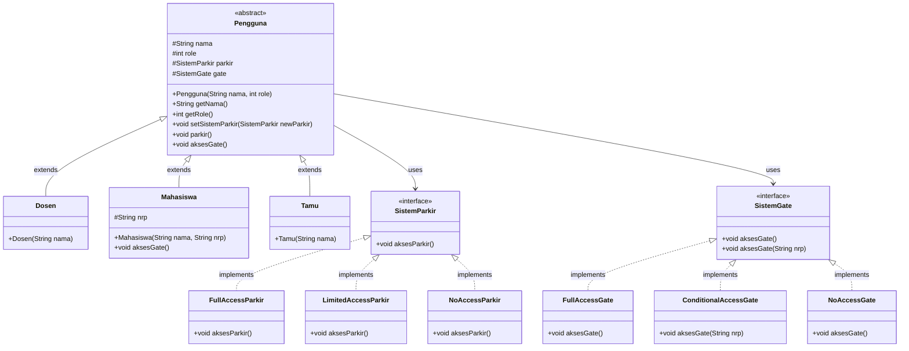

# Simulasi Sistem Parkir Gate Teknik Elektro ITS

> [!NOTE]
> Status: **Completed**
>
> Dokumentasi lengkap untuk sistem parkir dan gate dengan implementasi penuh OOP

| Nama              | NRP        |
| ----------------- | ---------- |
| Hendra Manudinata | 5027251051 |

---

## Deskripsi Kasus

Sistem Parkir Gate Teknik Elektro ITS adalah sebuah aplikasi simulasi untuk mengelola akses pintu gate dan fasilitas parkir berdasarkan peran pengguna. Sistem ini dirancang untuk:

- **Dosen**: Memiliki akses penuh ke gate dan parkir dengan layanan VIP
- **Mahasiswa**: Memiliki akses parkir terbatas dan akses gate dengan verifikasi NRP (batasan: 5022, 5023, 5024, 5027)
- **Tamu**: Tidak memiliki akses ke gate dan parkir

---

## Class Diagram



**Penjelasan Diagram:**

- **Pengguna**: Kelas abstrak sebagai base class untuk semua jenis pengguna
- **Dosen, Mahasiswa, Tamu**: Subclass yang mewarisi dari Pengguna
- **SistemParkir & SistemGate**: Interface yang mendefinisikan kontrak untuk implementasi
- **Polimorfisme**: Setiap implementasi interface memiliki behavior berbeda sesuai dengan aturan aksesnya

---

## Kode Program Java

### 1. Pengguna.java (Abstract Base Class)

```java
// Abstract class untuk Pengguna
abstract class Pengguna {
    protected String nama;
    protected int role; // 1: Dosen, 2: Mahasiswa, 3: Tamu
    protected SistemParkir parkir; // Sistem parkir yang digunakan oleh pengguna
    protected SistemGate gate; // Sistem gate yang digunakan oleh pengguna

    public Pengguna(String nama, int role) {
        this.nama = nama;
        this.role = role;
    }

    public String getNama() { return nama; }
    public int getRole() { return role; }

    // Special Setter untuk mengubah hak parkir secara dinamis
    public void setSistemParkir(SistemParkir newParkir) {
        this.parkir = newParkir;
    }

    public void parkir() { parkir.aksesParkir(); }
    public void aksesGate() { gate.aksesGate(); }
}
```

### 2. Dosen.java, Mahasiswa.java, Tamu.java (Concrete Classes)

```java
// Kelas untuk Dosen
class Dosen extends Pengguna {
    public Dosen(String nama) {
        super(nama, 1);
        this.parkir = new FullAccessParkir();
        this.gate = new FullAccessGate();
    }
}

// Kelas untuk Mahasiswa
class Mahasiswa extends Pengguna {
    protected String nrp;

    public Mahasiswa(String nama, String nrp) {
        super(nama, 2);
        this.nrp = nrp;
        this.parkir = new LimitedAccessParkir();
        this.gate = new ConditionalAccessGate();
    }

    @Override
    public void aksesGate() {
        gate.aksesGate(nrp);
    }
}

// Kelas untuk Tamu
class Tamu extends Pengguna {
    public Tamu(String nama) {
        super(nama, 3);
        this.parkir = new NoAccessParkir();
        this.gate = new NoAccessGate();
    }
}
```

### 3. SistemParkir.java (Interface & Implementations)

```java
// Interface untuk Sistem Parkir
interface SistemParkir {
    void aksesParkir();
}

// Implementasi untuk Dosen (Full Access)
class FullAccessParkir implements SistemParkir {
    @Override
    public void aksesParkir() {
        System.out.println("Akses parkir + VIP.");
    }
}

// Implementasi untuk Mahasiswa (Limited Access)
class LimitedAccessParkir implements SistemParkir {
    @Override
    public void aksesParkir() {
        System.out.println("Akses parkir saja.");
    }
}

// Implementasi untuk Tamu (No Access)
class NoAccessParkir implements SistemParkir {
    @Override
    public void aksesParkir() {
        System.out.println("Tidak memiliki akses parkir.");
    }
}
```

### 4. SistemGate.java (Interface & Implementations)

```java
// Interface untuk boleh tidaknya pintu gate dibuka
interface SistemGate {
    default void aksesGate() {
        System.out.println("Metode ini tidak didukung di gate ini.");
    }

    default void aksesGate(String nrp) {
        System.out.println("Metode dengan NRP tidak didukung di gate ini.");
    }
}

class FullAccessGate implements SistemGate {
    @Override
    public void aksesGate() {
        System.out.println("Akses gate diizinkan.");
    }
}

class ConditionalAccessGate implements SistemGate {
    @Override
    public void aksesGate(String nrp) {
        if (nrp.startsWith("5022") || nrp.startsWith("5023") ||
            nrp.startsWith("5024") || nrp.startsWith("5027")) {
            System.out.println("Akses gate diizinkan untuk NRP: " + nrp);
        } else {
            System.out.println("Akses gate dilarang.");
        }
    }
}

class NoAccessGate implements SistemGate {
    @Override
    public void aksesGate() {
        System.out.println("Akses gate dilarang.");
    }
}
```

### 5. App.java (Main Program)

```java
// Simulasi Sistem Parkir Gate di Teknik Elektro ITS

public class App {
    public static void main(String[] args) throws Exception {

        Dosen dosen = new Dosen("Aris");
        Mahasiswa mahasiswa = new Mahasiswa("Hendra", "5027251051");
        Tamu tamu = new Tamu("Bambang Pramujati");

        System.out.println("Dosen:");
        System.out.println(dosen.getNama());
        dosen.aksesGate();
        dosen.parkir();

        System.out.println("\nMahasiswa:");
        System.out.println(mahasiswa.getNama());
        mahasiswa.aksesGate();
        mahasiswa.parkir();

        System.out.println("   ... eh tiba-tiba Mahasiswa diupgrade akses parkirnya!");
        mahasiswa.setSistemParkir(new FullAccessParkir());
        mahasiswa.parkir();

        System.out.println("\nTamu:");
        System.out.println(tamu.getNama());
        tamu.aksesGate();
        tamu.parkir();
    }
}
```

---

## Screenshot Output

```
Dosen:
Aris
Akses gate diizinkan.
Akses parkir + VIP.

Mahasiswa:
Hendra
Akses gate diizinkan untuk NRP: 5027251051
Akses parkir saja.
   ... eh tiba-tiba Mahasiswa diupgrade akses parkirnya!
Akses parkir + VIP.

Tamu:
Bambang Pramujati
Akses gate dilarang.
Tidak memiliki akses parkir.
```

---

## Penjelasan Prinsip-Prinsip OOP

### 1. **Encapsulation** (Enkapsulasi)

Menggabungkan data dan metode dalam sebuah unit (kelas) dan menyembunyikan detail implementasi dari luar.

**Implementasi:**

- Atribut `nama`, `role`, `parkir`, dan `gate` dideklarasikan dengan modifier `protected` di kelas `Pengguna`
- Hanya dapat diakses melalui getter (`getNama()`, `getRole()`) dan setter (`setSistemParkir()`)
- Melindungi integritas data dan memastikan akses terkontrol

**Contoh Kode:**

```java
protected String nama;  // Tidak bisa diakses langsung dari luar
public String getNama() { return nama; }  // Akses melalui method
```

### 2. **Inheritance** (Pewarisan)

Memungkinkan kelas anak (subclass) mewarisi atribut dan metode dari kelas induk (superclass).

**Implementasi:**

- `Dosen`, `Mahasiswa`, dan `Tamu` mewarisi dari kelas `Pengguna`
- Setiap kelas anak dapat menambahkan atribut tambahan (contoh: `nrp` pada Mahasiswa)
- Setiap kelas anak dapat menggunakan atribut/metode dari kelas induk

**Contoh Kode:**

```java
class Dosen extends Pengguna {
    public Dosen(String nama) {
        super(nama, 1);  // Memanggil constructor parent
        this.parkir = new FullAccessParkir();
    }
}
```

### 3. **Polymorphism** (Polimorfisme)

Satu interface dapat digunakan untuk berbagai jenis objek, memungkinkan behavior berbeda berdasarkan tipe objek.

**Implementasi:**

- Interface `SistemParkir` diimplementasikan oleh `FullAccessParkir`, `LimitedAccessParkir`, dan `NoAccessParkir`
- Metode `aksesParkir()` memiliki behavior berbeda tergantung implementasinya
- Pengguna memiliki atribut `parkir` bertipe `SistemParkir`, yang dapat direferensikan ke salah satu implementasi

**Contoh Kode:**

```java
SistemParkir parkir;  // Interface reference
parkir = new FullAccessParkir();    // Bisa direferensikan ke FullAccessParkir
parkir = new LimitedAccessParkir(); // Atau ke LimitedAccessParkir
parkir.aksesParkir();  // Behavior berubah sesuai implementasi
```

### 4. **Abstraction** (Abstraksi)

Menyembunyikan kompleksitas dan hanya menampilkan fitur esensial kepada pengguna.

**Implementasi:**

- Kelas `Pengguna` adalah kelas abstrak yang tidak bisa diinstansiasi langsung
- Mendefinisikan struktur umum untuk semua jenis pengguna
- Subclass mengimplementasikan detail spesifik mereka

**Contoh Kode:**

```java
abstract class Pengguna {
    // Harus dibuat menggunakan subclass: Dosen d = new Dosen(...)
}
```

---

## Keunikan yang Membedakan Sistem Ini

### 1. **Strategy Pattern Implementation**

- Menggunakan interface `SistemParkir` dan `SistemGate` untuk mengimplementasikan Strategy Pattern
- Memungkinkan pergantian behavior secara dinamis tanpa mengubah struktur kelas
- Contoh: `mahasiswa.setSistemParkir(new FullAccessParkir())` mengubah perilaku parkir saat runtime

### 2. **Default Methods dalam Interface**

```java
interface SistemGate {
    default void aksesGate() { ... }
    default void aksesGate(String nrp) { ... }
}
```

- Menggunakan default method (Java 8+) untuk menyediakan implementasi standar
- Subclass dapat override atau menggunakan implementasi default
- Memberikan fleksibilitas tanpa perlu membuat abstract class

### 3. **Method Overriding dengan Parameter Override**

```java
// Di kelas Mahasiswa
@Override
public void aksesGate() {
    gate.aksesGate(nrp);  // Override dengan parameter tambahan
}
```

- Menunjukkan polimorfisme runtime
- Method pada subclass mempunyai perilaku berbeda dari parent class

### 4. **Verifikasi NRP dengan Kondisi Dinamis**

```java
if (nrp.startsWith("5022") || nrp.startsWith("5023") ||
    nrp.startsWith("5024") || nrp.startsWith("5027"))
```

- Implementasi validasi berbasis prefix NRP
- Hanya mahasiswa dari departemen tertentu (Teknik Elektro ITS) yang memiliki akses
- Menunjukkan penerapan business logic yang realistis

### 5. **Composition over Inheritance**

- Menggunakan composition (atribut `parkir` dan `gate` dalam `Pengguna`)
- Lebih fleksibel daripada inheritance untuk mengatur behavior
- Memudahkan perubahan behavior tanpa perlu membuat subclass baru

### 6. **Role-Based Access Control (RBAC)**

- Sistem berbasis role (Dosen, Mahasiswa, Tamu)
- Setiap role memiliki policy akses yang berbeda
- Mudah diperluas untuk menambah role baru
